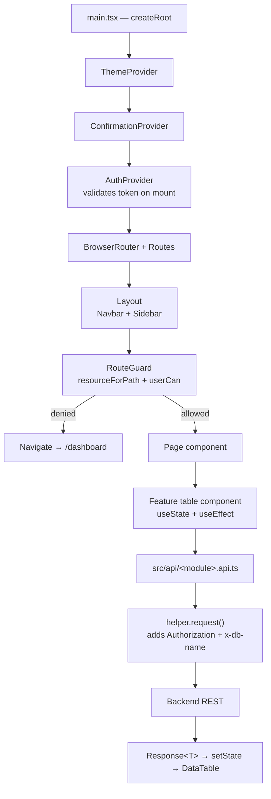
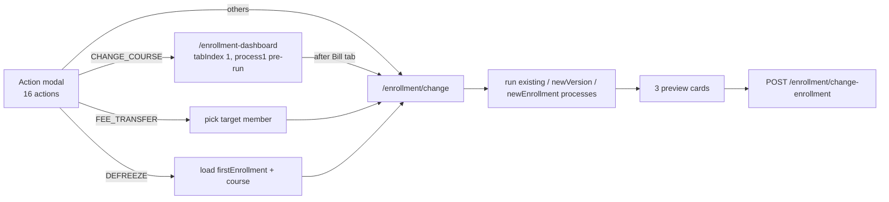

# TSL Frontend — Tanna Sports Academy Management Console

The single-page web console for the Tanna Sports Academy (TSL) operation: members
and accounts, memberships, the course catalogue, batches and attendance,
enrolments and their mid-term changes, facilities, staff, and double-entry
accounting.

It is a React 19 + TypeScript + Vite SPA that talks to
[`tsl-project-backend`](../tsl-project-backend) over REST. There is no server-side
rendering, no state-management library, and no data-fetching library — every
screen owns its own `useState`/`useEffect` fetch loop.

This document is the onboarding guide. Read it top to bottom once and you should
be able to find anything in the codebase.

---

## Table of contents

1. [What this app does](#1-what-this-app-does)
2. [Tech stack](#2-tech-stack)
3. [Quick start](#3-quick-start)
4. [Project layout](#4-project-layout)
5. [How a screen works](#5-how-a-screen-works)
6. [Authentication, database selection & RBAC](#6-authentication-database-selection--rbac)
7. [Routing map — every route](#7-routing-map--every-route)
8. [The four building blocks](#8-the-four-building-blocks)
9. [The standard CRUD module recipe](#9-the-standard-crud-module-recipe)
10. [Module reference — every screen](#10-module-reference--every-screen)
11. [The Enrollment system (deep dive)](#11-the-enrollment-system-deep-dive)
12. [Finance & accounting screens](#12-finance--accounting-screens)
13. [Settings & lookups](#13-settings--lookups)
14. [Design system, theming & UI kit](#14-design-system-theming--ui-kit)
15. [Shared utilities reference](#15-shared-utilities-reference)
16. [API layer reference](#16-api-layer-reference)
17. [Known gaps & landmines](#17-known-gaps--landmines)
18. [How to add a new module](#18-how-to-add-a-new-module)
19. [Build & deploy](#19-build--deploy)

---

## 1. What this app does

TSL rents facilities, runs coached courses, and bills families. The frontend
mirrors the backend's five domain layers, one navigation section per layer:

| Layer | Question it answers | Screens |
|---|---|---|
| **People & orgs** | Who is involved? | Members, Accounts, Account Members, Authority, Entities |
| **Membership** | What is their entitlement? | Membership Master, Membership Issue, Membership Link |
| **Catalogue** | What can be sold? | Activities, Courses, Course Rates, Course Packages, Course Shares |
| **Delivery** | When/where does it happen, who runs it? | Batches, Attendance Sheet, Session Booking, Facilities, Areas, Facility Allotment, Coach Skills, Coach Assignment |
| **Money** | Who owes what? | Enrollment Dashboard, Enrollment list, Enrollment Change, Transactions, Ledger, Trial Balance |

The pivotal concept is the **Enrollment** — one member buying one course for a
date range. Creating one is a six-step wizard; *changing* one mid-term (quit,
freeze, course swap, fee transfer…) runs a numbered financial process that
computes a closing bill, a new "version" of the old enrollment, and optionally a
brand-new enrollment. That machinery is documented in
[§11](#11-the-enrollment-system-deep-dive).

**Scale:** ~333 TypeScript/TSX files, ~50k lines, 38 API modules, 36 type modules,
31 UI primitives, 26 feature modules, 40+ routes.

---

## 2. Tech stack

| Concern | Choice |
|---|---|
| Framework | React **19.1** (function components + hooks only) |
| Language | TypeScript **5.8**, `strict: true`, `verbatimModuleSyntax` |
| Build tool | **Vite 6** with `@vitejs/plugin-react-swc` |
| Routing | `react-router-dom` **7** (`BrowserRouter`, nested layout routes) |
| Styling | **Tailwind CSS 3.4** + CSS custom properties (HSL tokens) |
| Component kit | **shadcn/ui** (new-york style, `zinc` base) on **Radix UI** primitives |
| Icons | `lucide-react` |
| Animation | `framer-motion` |
| Charts | `recharts` (dashboard only) |
| Tables | Hand-rolled `DataTable` + `react-virtuoso` for virtualised import grids |
| Excel | `xlsx` (SheetJS) — both import and export |
| PDF | `jspdf` + `html2canvas` (deposit slips, attendance sheets) |
| Dates | `date-fns` v4, `react-day-picker` v9 |
| Server state | **None** — plain `fetch` in `src/api/*`, `useState` + `useEffect` in components |
| Global state | React Context only (`auth`, `theme`, `confirmation`) |
| Lint | ESLint 9 flat config + `typescript-eslint` + react-hooks/react-refresh |
| Hosting | Vercel (SPA rewrite in `vercel.json`) |

There is **no test suite**, **no Storybook**, and **no CI config** in this repo.

---

## 3. Quick start

### Prerequisites

- **Node.js 18+** (Node 20+ recommended — Vite 6 requires ≥18)
- The backend running and reachable (default `http://localhost:9705`)

> `.npmrc` sets `engine-strict=true`, so npm will hard-fail on an unsupported
> Node version rather than warn.

### Install & run

```bash
npm install
npm run dev        # Vite dev server → http://localhost:5173
```

### Scripts

| Script | What it does |
|---|---|
| `npm run dev` | Vite dev server with HMR |
| `npm run build` | `tsc -b && vite build` — type-checks the whole project, then bundles to `dist/` |
| `npm run preview` | Serves `dist/` on port **4173** (`strictPort: true`) |
| `npm run lint` | ESLint over the repo |

`npm run build` is a real type-check gate: a type error anywhere fails the build.
A clean build currently produces ~3,700 modules and a ~2.9 MB main chunk
(~847 kB gzipped) — see [§17](#17-known-gaps--landmines).

### Environment variables

Vite only exposes variables prefixed `VITE_`. Create `.env` in the repo root:

```dotenv
VITE_APP_API_URL=http://localhost:9705/api
VITE_APP_R2_PUBLIC_ENDPOINT=https://pub-xxxxxxxx.r2.dev
```

| Variable | Required | Purpose |
|---|---|---|
| `VITE_APP_API_URL` | **yes** | Base URL of the backend API. Every `src/api/*.ts` module builds its endpoints from it. Only `enrollmentActions.api.ts` has a fallback (`http://localhost:9705/api`); everywhere else an unset value silently produces `undefined/member` URLs. |
| `VITE_APP_R2_PUBLIC_ENDPOINT` | for avatars | Public Cloudflare R2 base URL used to render member avatars (`member-table.tsx`, `member-tab.tsx`). |
| `VITE_APP_ROUTE_SECRET_KEY` | no | Read by `src/helpers/secureRoute.ts` (AES-GCM route-param encryption). **That helper is currently dead code** — nothing imports it. |

Restart the dev server after editing `.env` — Vite inlines these at build time.

### First login

1. Open `/login`.
2. Sign in with a backend user.
3. **admin / superadmin** are shown a *Select Database* modal (populated from
   `GET /user/databases`); the choice is stored in `localStorage.selected_db_name`
   and sent as the `x-db-name` header on every subsequent request.
4. **staff** skip the modal and are pinned to the `tsl-project` database.

---

## 4. Project layout

```
tsl-project-frontend/
├── index.html                 # Vite entry; <div id="root">
├── vite.config.ts             # React SWC plugin, "@" → ./src alias, preview port 4173
├── tailwind.config.js         # HSL design tokens, darkMode: "class", tailwindcss-animate
├── components.json            # shadcn/ui generator config (new-york, zinc, cssVariables)
├── vercel.json                # SPA rewrite: /(.*) → /
├── eslint.config.js           # Flat config
├── tsconfig.json / .app.json / .node.json
│
└── src/
    ├── main.tsx               # createRoot + StrictMode + ThemeProvider
    ├── App.tsx                # Provider stack + the entire route table
    ├── index.css              # Tailwind layers + light/dark CSS variables
    │
    ├── api/                   # 38 modules — one per backend resource. fetch wrappers only.
    │   └── helper.ts          # request(), toQueryString(), getSelectedDb()
    │
    ├── config/
    │   └── permissions.ts     # Frontend mirror of backend lib/permissions.js
    │
    ├── contexts/
    │   ├── authContext.tsx    # Session: token, user, login/logout, token validation
    │   ├── theme-context.tsx  # light/dark/system, persisted to localStorage
    │   └── confirmation-context.tsx  # Promise-based confirm() dialog
    │
    ├── hooks/
    │   ├── use-permissions.ts # { role, can(resource, action) }
    │   ├── use-toast.ts       # shadcn toast reducer (TOAST_LIMIT 1, 3s auto-dismiss)
    │   └── use-mobile.tsx     # useIsMobile() — 768px breakpoint
    │
    ├── lib/
    │   ├── utils.ts           # cn(), formatTime(), formatDateForInput(), isValidUrl()
    │   └── export-to-excel.ts # exportToExcel(rows, columns, fileName)
    │
    ├── helpers/
    │   ├── enrollment.ts      # getFinalAmounts(), calsPermittedDays() — the money math
    │   ├── helper.ts          # misc formatting
    │   ├── secureRoute.ts     # AES-GCM param encryption (unused)
    │   └── enrollment-change/ # workflow.ts + process1..process10.ts
    │
    ├── types/                 # 36 domain interfaces, one file per entity
    │   └── response.ts        # Response<T> = { success, message, data, pagination }
    │
    ├── pages/                 # 36 route-level screens (33 wired into the router)
    │
    └── components/
        ├── layout.tsx         # Navbar + Sidebar + RouteGuard + <Outlet/>
        ├── navbar.tsx         # Brand, check-in toggle, batch requests, settings menu, theme, profile
        ├── sidebar.tsx        # Main nav, permission-filtered
        ├── settingSidebar.tsx # Settings-area nav
        ├── route-guard.tsx    # Resource-level route authorization
        ├── login-form.tsx     # Login + database picker
        ├── ExcelUploader.tsx  # Generic virtualised Excel importer
        ├── data-table/        # DataTable, toolbar, pagination, mobile cards
        ├── form-modal/        # Schema-driven create/edit dialog
        ├── view-modal/        # Schema-driven read-only detail dialog
        ├── dialogs/           # ConfirmDialog
        ├── ui/                # 30 shadcn/ui primitives
        ├── setting/           # Settings-area feature modules
        └── view/              # 26 feature modules (table/form/view/import per entity)
```

**Rule of thumb:** `pages/*` owns modal open/close state and page chrome;
`components/view/<module>/*-table.tsx` owns fetching, filters, pagination and
columns; `src/api/*` owns URLs and payload shapes. Business logic that isn't
rendering lives in `src/helpers/`.

---

## 5. How a screen works



Two things every contributor must internalise:

1. **`request()` never throws on an HTTP error.** `src/api/helper.ts` catches
   network failures and returns `{ success: false, message, data: null }`. A `500`
   from the backend still resolves — you must check `res.success` (and often
   `res.data`) yourself. Several components wrap calls in `try/catch` *as well*,
   which is harmless but not what actually catches API failures.

2. **There is no cache.** Every table re-fetches on mount and whenever its
   `page`/`limit`/`search`/`filters`/`sortBy`/`refreshKey` change. Pages force a
   refresh after a mutation by bumping a `refreshKey` counter passed down as a prop.

### The provider stack (`App.tsx`)

```
ThemeProvider → ConfirmationProvider → AuthProvider → Router → Routes
                                                              └ Toaster (outside Router)
```

`ThemeProvider` is mounted **twice** — once in `main.tsx` and again in `App.tsx`.
Harmless (the inner one wins) but redundant.

---

## 6. Authentication, database selection & RBAC

**Files:** `contexts/authContext.tsx`, `components/login-form.tsx`,
`config/permissions.ts`, `hooks/use-permissions.ts`, `components/route-guard.tsx`,
`api/helper.ts`

### Session lifecycle

| Step | What happens |
|---|---|
| Login | `POST /user/login` → `{ success, token, user }`. Token stored at `localStorage.token`. |
| DB pick | Non-staff: `GET /user/databases` → modal → `localStorage.selected_db_name`. Staff: forced to `"tsl-project"`. |
| Bootstrap | On every mount (except on `/login`) `AuthProvider` calls `GET /user/validate` with the stored token. On success it sets `user` and **accepts a rotated token** if the response carries a different one. On failure it logs out. |
| Every request | `helper.request()` attaches `authorization: Bearer <token>` and `x-db-name: <selected_db_name>`. |
| Logout | Clears `token` + `selected_db_name`, then `window.location.replace("/login")` (a full page reload, deliberately nuking all in-memory state). |

> **There is no `<ProtectedRoute>`.** Authentication is enforced by the
> `AuthProvider` effect: no token ⇒ immediate `logout()` ⇒ hard redirect to
> `/login`. While `isLoading` is true, pages render with `user === null`, so any
> component that reads `user` must tolerate `null`.

### The permission model

`src/config/permissions.ts` is a **deliberate mirror of the backend's
`lib/permissions.js`** — keep the two in sync. It is a *resource-level* model:
if you can reach a module, you get all four actions on it.

```ts
type Action   = "read" | "create" | "update" | "delete"
type Role     = "superadmin" | "admin" | "staff"
```

**16 resources:** `Member`, `Account`, `Authority`, `Enrollment`, `Batch`,
`Course`, `Membership`, `Facility`, `CoachSkill`, `CoachAssignment`, `Attendance`,
`Appointment`, `Discount`, `Finance`, `Settings`, `User`.

| Role | Baseline |
|---|---|
| `superadmin` | `"*"` — everything |
| `admin` | `"*"` — everything (the comment notes this "will be narrowed later") |
| `staff` | Every resource **except** `Settings` and `User` |

**Per-user overrides** layer on top of the role:

```
effective = roleResources ∪ access.grants − access.revokes      ("*" stays "*")
```

Stored on the user record as `access: { grants: [], revokes: [] }` and edited on
the **User Access** screen (`/staff-management/user-access`).

### The three enforcement points

| Point | File | Behaviour |
|---|---|---|
| Sidebar filtering | `sidebar.tsx` (`RESOURCE_BY_HREF`) | Hides links the role cannot read; a section whose children are all hidden disappears entirely. |
| Settings menu | `navbar.tsx` | The gear dropdown renders only when `can("Settings")`. |
| Route guard | `route-guard.tsx` + `resourceForPath()` | Maps `location.pathname` to a resource by **longest matching prefix** and redirects to `/dashboard` if `userCan(...)` is false. Renders children untouched while the session is still loading. |

Using it in a component:

```ts
const { can, role } = usePermissions()
if (can("Finance", "update")) { /* … */ }
```

> ⚠️ **Nothing gates in-page buttons.** `usePermissions` is used only by the
> navbar and sidebar. Create/Edit/Delete buttons render for everyone who can
> reach the page. The backend is the real enforcement point — see
> [§17](#17-known-gaps--landmines).

---

## 7. Routing map — every route

All routes are declared in `src/App.tsx`.

### Public

| Path | Component |
|---|---|
| `/login` | `components/login-form.tsx` |
| `/signup` | `pages/Signup.tsx` — username/email/password + role picker |
| `/404error` | `pages/NotFound.tsx` (declared in its own `<Routes>` block) |

### Main app — wrapped in `Layout` (navbar + sidebar + `RouteGuard`)

| Path | Screen | Guarded resource |
|---|---|---|
| `/` | → redirect to `/dashboard` | — |
| `/dashboard` | `pages/dashboard.tsx` | — (visible to all) |
| `/profile` | `pages/profile.tsx` — change own password | — |
| `/enrollment-dashboard` | `view/enrollment-dashboard-new/enrollment-flow.tsx` — the 6-step wizard | `Enrollment` |
| `/enrollment` | `pages/enrollment.tsx` — enrollment list | `Enrollment` |
| `/enrollment/change` | `pages/Change.tsx` — mid-term change processor | `Enrollment` |
| `/enrollment/:id/refund` | `view/enrollment-actions/Refund.tsx` | `Enrollment` |
| `/account/accounts` | `pages/account.tsx` | `Account` |
| `/account/account-member` | `pages/accountMember.tsx` | `Account` |
| `/account/authority` | `pages/authority.tsx` | `Authority` |
| `/account/member` | `pages/member.tsx` | `Account` (prefix `/account`) |
| `/bookings/session` | `pages/SessionBooking.tsx` | `Appointment` |
| `/course/courses` | `pages/course.tsx` | `Course` |
| `/course/course-share` | `pages/courseShare.tsx` | `Course` |
| `/course/course-rate` | `pages/course-rate.tsx` | `Course` |
| `/course/course-package` | `pages/course-package.tsx` | `Course` |
| `/batches` | `pages/batch.tsx` | `Batch` |
| `/batch/attendance-sheet/:id` | `view/batch/attendance-sheet.tsx` | `Batch` |
| `/discount` | `pages/discount.tsx` | `Discount` |
| `/infrastructure-configurations/facility` | `pages/facility.tsx` | `Facility` |
| `/infrastructure-configurations/area` | `pages/area.tsx` | `Facility` |
| `/infrastructure-configurations/facility-allotment` | `pages/facilityAllotment.tsx` | `Facility` |
| `/infrastructure-Configurations` | → redirect to `.../facility` (capital-C legacy path) | `Facility` |
| `/membership/membership-master` | `pages/membershipMaster.tsx` | `Membership` |
| `/membership/membership-registration` | `pages/membership.tsx` | `Membership` |
| `/membership/membership-link` | `pages/membership-link.tsx` | `Membership` |
| `/finance/transaction` | `pages/transaction.tsx` | `Finance` |
| `/finance/ledger` | `pages/ledger.tsx` | `Finance` |
| `/finance/trialbalance` | `view/transaction/transaction-trialbalance.tsx` | `Finance` |
| `/staff-management/access-details` | `pages/access-details.tsx` — user CRUD | `User` |
| `/staff-management/user-access` | `view/user/UserAccessPage.tsx` — role + override matrix | `User` |
| `/staff-management/coach-assignment` | `pages/coachAssignment.tsx` | `CoachAssignment` |
| `/staff-management/coach-skills` | `pages/coachSkill.tsx` | `CoachSkill` |
| `/staff-management/attendance` | `pages/staff-attendance.tsx` | `Attendance` |
| `/projects` | `pages/projects.tsx` — **stub** (`<h1>Projects</h1>`) | — |
| `*` | `pages/NotFound.tsx` | — |

### Settings — wrapped in `Setting` (settings sidebar + `RouteGuard`)

Everything under `/setting` maps to the `Settings` resource.

| Path | Screen |
|---|---|
| `/setting/entity` | `pages/entity.tsx` |
| `/setting/family-type` | `setting/family-type/family-type.tsx` |
| `/setting/team-category` | `setting/team-category/team-category.tsx` |
| `/setting/identity-type` | `setting/identity-type/identity-type.tsx` |
| `/setting/activity` | `setting/activity/activity.tsx` |
| `/setting/common-lookups` | `setting/enums/enums.tsx` |
| `/setting/status` | `pages/status-visible.tsx` |
| `/setting/*` | `pages/NotFound.tsx` |

> `/setting` has **no index route** — landing on it exactly renders the sidebar
> with an empty content area.

### Routes referenced but not implemented

- `/bookings/booking` — linked from the sidebar, falls through to `NotFound`.
- `pages/family.tsx`, `pages/payment.tsx`, `pages/reports.tsx` exist on disk but
  are **not wired into the router**.

---

## 8. The four building blocks

Almost every screen is assembled from these four generic components. Learn them
first; the 26 feature modules are mostly configuration on top.

### 8.1 `DataTable` — `components/data-table/`

Generic, server-driven table. **It does not sort, filter or paginate locally** —
it raises callbacks and renders whatever `data` you hand it.

```tsx
<DataTable<Area>
  data={rows} columns={columns} isLoading={isLoading}
  pagination={{ page, limit, total, onPageChange }}
  onSearchChange={…} onFilterChange={…} onSortChange={…}
  onView={…} onEdit={…} onDelete={…} onCopy={…} onPrint={…}
  idKey="areaId"
  exportFileName="Area" onExport={handleExport}
/>
```

| Prop | Meaning |
|---|---|
| `columns: Column<T>[]` | `{ key, header, sortable?, filterType?, filterOptions?, render?, width?, align?, hidden? }` |
| `pagination` | Page state + `onPageChange` / `onPageSizeChange` |
| `onSearchChange` / `onFilterChange` / `onSortChange` | Fired on toolbar interaction; the parent re-fetches |
| `onView` / `onEdit` / `onDelete` / `onCopy` / `onPrint` | Render the corresponding row-hover action icon. Omit one to hide it. `onDelete` receives `row[idKey]`, the others receive the whole row |
| `onExport` | `() => Promise<T[]>` — the parent refetches **all** rows, the table derives columns from the union of returned keys and writes an `.xlsx` |

Built-in behaviour: column show/hide, **mouse-drag column resizing**, sticky
header, zebra striping, `framer-motion` row entry animation, a spinner while
`isLoading`, an empty state that still shows the toolbar, and a separate
`TableMobileCard` list rendered below the `md` breakpoint.

Sub-components: `table-toolbar.tsx` (search / filters / column picker / sort /
export), `table-pagination.tsx`, `table-mobile-card.tsx`.

### 8.2 `FormModal` — `components/form-modal/`

Schema-driven create/edit dialog.

```tsx
<FormModal<Area>
  isOpen={open} onClose={close}
  title="Add Area" icon={<MapPinned />}
  fields={fields} initialData={editRow ?? {}}
  onSubmit={handleSubmit} submitLabel="Save"
  layout="grid"
/>
```

A field is a `FormFieldConfig<T>`:

| Key | Purpose |
|---|---|
| `name`, `label`, `type` | `text \| email \| password \| number \| textarea \| select \| checkbox \| date \| multiselect \| time` |
| `required`, `validation` | Built-in required/email/number checks, plus a custom `(value) => string \| true` |
| `options` | For `select` / `multiselect` |
| `condition` | `(values) => boolean` — conditional visibility driven by the live form state |
| `onSearch`, `onLoadMore`, `isLoadingMore` | Async/paged option loading for searchable selects |
| `colSpan`, `className`, `icon`, `disabled`, `hidden`, `minDate`, `maxDate` | Presentation |

Validation runs on submit; per-field errors clear as soon as the field changes.
`onSubmit` errors surface both inline and as a destructive toast. The dialog
auto-switches to a 95vw mobile layout via `useIsMobile()`.

`form-field-input.tsx` also exports **`SearchableMultiselect`** — a Radix
popover + command palette used standalone across the app (e.g. the member
duplicate-check bar). Pass `isSingle` for single-select behaviour.

### 8.3 `ViewModal` — `components/view-modal/`

Read-only detail dialog that fetches its own data.

```tsx
<ViewModal<Member>
  isOpen={open} onClose={close}
  itemId={id} fetchFn={getMemberById}
  title="Member" fields={fields} layout="grid"
/>
```

Each `FieldConfig<T>` is `{ key, label, icon?, render?, className?, type? }`.
Setting `type: "button"` plus a `button: { label, onClick, variant, size, span }`
turns a row into an action button — this is how detail modals link out to
related records.

### 8.4 `ExcelUpload` — `components/ExcelUploader.tsx`

Generic bulk-import grid used by **23 modules**. It parses a workbook client-side
with SheetJS and then creates rows **one at a time** through the API.

```tsx
<ExcelUpload<AreaImportRow>
  title="Facility Sub-Area Master"
  expectedColumns={["facilityId", "areaName", …]}
  validateRow={(row) => string | null}
  createFunction={async (row, index) => { await createArea(mapped) }}
  onUploadComplete={onSuccess}
/>
```

Behaviour worth knowing:

- Drag-and-drop or click; reads the **first non-empty sheet** of the workbook.
- Renders with `react-virtuoso` (`TableVirtuoso`), so 10k-row files stay smooth.
- **Sequential** upload with a live progress bar and per-row status icons.
- **Stops on the first error**, highlights the failing row and shows the message.
  You then **double-click the cell to fix it in place** and hit *Retry & Resume* —
  processing continues from that index, not from the top.
- Pause / Resume, delete row, delete column, clear all.

Per-module wrappers (`<module>-excel-upload.tsx`) supply the dialog chrome, the
expected columns, a `validateRow` guard, and the row → payload mapping.

---

## 9. The standard CRUD module recipe

Twenty-plus modules follow exactly this shape. Once you can read one, you can
read all of them.

```
src/api/<entity>.api.ts                 get<X>s / get<X>ById / create<X> / update<X> / delete<X>
src/types/<entity>.ts                   the interface
src/pages/<entity>.tsx                  page chrome + modal state + refreshKey
src/components/view/<entity>/
    <entity>-table.tsx                  fetch loop, columns, filters, delete confirm
    <entity>-form-modal.tsx             FormModal field schema + submit
    <entity>-view-modal.tsx             ViewModal field schema
    <entity>-excel-upload.tsx           ExcelUpload wrapper (most modules)
```

**The page** owns nothing but state:

```tsx
const [formOpen, setFormOpen]   = useState(false)
const [viewOpen, setViewOpen]   = useState(false)
const [excelOpen, setExcelOpen] = useState(false)
const [editRow, setEditRow]     = useState<X>()
const [refreshKey, setRefresh]  = useState(0)
const bump = () => setRefresh(k => k + 1)   // forces the table to re-fetch
```

**The table** owns the data loop:

```tsx
const loadData = useCallback(async () => {
  setIsLoading(true)
  const res = await getXs({ page, limit, sortBy, sortOrder, search, ...filters })
  setTotal(res.pagination.total)
  setData(res.data ?? [])
  setIsLoading(false)
}, [page, limit, sortBy, sortOrder, search, filters])

useEffect(() => { loadData() }, [loadData, refreshKey])
```

Deletion always goes through `ConfirmDialog` (`components/dialogs/confirm-dialog.tsx`)
with `variant="destructive"`, then a `toast()` and a reload. A promise-based
alternative exists for imperative flows:

```ts
const { confirm } = useConfirmation()
if (await confirm({ title: "Delete?", variant: "destructive" })) { … }
```

Export is implemented per-table as `handleExport()` — the same query re-run with
`limit: total`, returning every row for the spreadsheet.

---

## 10. Module reference — every screen

### 10.1 People & organisations

| Screen | Route | Notes |
|---|---|---|
| **Members** | `/account/member` | The richest CRUD screen. Before you may add a member, the **duplicate-check bar** runs `checkDuplicateMemberByName`, `checkDuplicateEmail`, `checkDuplicateContact` and `checkDuplicateIdProof` in parallel; the *Add This Member* button only appears once the check comes back clean, and the entered values pre-fill the form. Also supports **copy-to-new-member** (`onCopy` strips `memberId`/timestamps), avatar upload/delete via R2, `?familyId=` deep-linking, and Excel import. |
| **Accounts** | `/account/accounts` | Billing accounts. Table / form / view / import. |
| **Account Members** | `/account/account-member` | Links members to accounts. Adds a **bulk form modal** (`account-member-bulk-form-modal.tsx`) alongside the single-record one, plus `isMemberAlreadyLinked` and `createAccountMemberWithMember` (create member + link in one shot). |
| **Authority** | `/account/authority` | Who may act on an account. `changeAuthority` and `getAuthorityByAccount` beyond plain CRUD. |
| **Entities** | `/setting/entity` | Legal/organisational entities (academies, TSL itself). Lives under Settings. |
| **Family** | *(unrouted)* | `pages/family.tsx` + `view/family/*` exist but no route points at them. |

### 10.2 Membership

| Screen | Route | Notes |
|---|---|---|
| **Membership Master** | `/membership/membership-master` | Membership plan definitions. Drives which `CourseRate` applies at enrollment time. |
| **Membership Issue** | `/membership/membership-registration` | Issues a membership to a member. |
| **Membership Link** | `/membership/membership-link` | Two-panel screen: `account-search-panel.tsx` (searchable account list) + `selected-accounts-panel.tsx` (staged selection), linking many accounts to one membership in a single submit. |

### 10.3 Catalogue

| Screen | Route | Notes |
|---|---|---|
| **Courses** | `/course/courses` | `course-form-modal.tsx` is ~900 lines: a tabbed builder whose `course-form/` sub-parts (`course-list`, `rate-list`, `package-list`, `share-list`, `course-footer`) let you author a course together with its rates, packages and revenue shares, submitted via `createFullCourse`. |
| **Course Rates** | `/course/course-rate` | Price per membership type / unit band. Read-only table + view + import (rates are created from the course builder). |
| **Course Packages** | `/course/course-package` | Same pattern. |
| **Course Shares** | `/course/course-share` | Revenue-share split per course. Same pattern. |
| **Activities** | `/setting/activity` | The activity master behind courses. Full CRUD + import, under Settings. |

### 10.4 Delivery — batches, sessions, facilities, staff

| Screen | Route | Notes |
|---|---|---|
| **Batches** | `/batches` | Batch CRUD + import. Rows link to the attendance sheet. |
| **Attendance Sheet** | `/batch/attendance-sheet/:id` | ~620 lines. Calendar-driven roster for one batch; marks attendance, **shifts members between batches** (`shiftMembers`) and exports the sheet to PDF with `jspdf`. |
| **Session Booking** | `/bookings/session` | Books ad-hoc sessions for pay-per-session enrollments: member search → eligible enrollments → batch/slot availability (day-of-week + `avbFrom`/`avbTo` + `sessionMinutes`) → `createSession`. Shows booking history. |
| **Facilities** | `/infrastructure-configurations/facility` | Venue master. |
| **Areas** | `/infrastructure-configurations/area` | Sub-zones of a facility (courts, sectors) with level, sq-ft and portion. |
| **Facility Allotment** | `/infrastructure-configurations/facility-allotment` | Allocates areas to courses/batches over time. |
| **Coach Skills** | `/staff-management/coach-skills` | Which coach can teach what. |
| **Coach Assignment** | `/staff-management/coach-assignment` | Assigns coaches to batches/courses. |
| **Staff Attendance** | `/staff-management/attendance` | Read-only day view of staff check-in/out built from `getAttendanceByDate`, grouped per user with per-session durations and totals. The **IN/OUT toggle in the navbar** feeds it via `checkIn` / `checkOut` / `isUserActive`. |

### 10.5 Staff & access

| Screen | Route | Notes |
|---|---|---|
| **Access & Details** | `/staff-management/access-details` | User CRUD (create/edit/delete users, assign roles). |
| **User Access** | `/staff-management/user-access` | The permission matrix. Pick a user, pick a role, then toggle individual resources; the page computes the **minimal `{ grants, revokes }` override** relative to the role baseline and PUTs it. Full-access roles (`admin`, `superadmin`) show every resource on and save an empty override. |
| **Profile** | `/profile` | Shows the signed-in user and lets them change their own password (`POST /user/change-password`). |

### 10.6 Enrollment & money

See [§11](#11-the-enrollment-system-deep-dive) and
[§12](#12-finance--accounting-screens).

### 10.7 Placeholder / mock screens

| Screen | State |
|---|---|
| `/dashboard` | **Entirely static mock data** — construction-industry copy ("Active Projects", "Equipment"), recharts area + pie charts, no API calls. It is a template, not a real dashboard. |
| `/projects` | `<h1>Projects</h1>` |
| `pages/reports.tsx` | `<h1>Reports</h1>`, unrouted |
| `components/UnderConstruction.tsx`, `components/loader.tsx` | Written, never imported |

---

## 11. The Enrollment system (deep dive)

This is the heart of the app and the only part with genuine domain complexity.

### 11.1 Creating an enrollment — the wizard

**`components/view/enrollment-dashboard-new/enrollment-flow.tsx`** → `/enrollment-dashboard`

Six tabs, in order:

```
member → course → courseRate → batch → bill → confirm
```

| Tab | File | Gate to advance |
|---|---|---|
| Member | `enrollment-tabs/member-tab/member-tab.tsx` (+ `add-member.tsx`, `enrollment-card.tsx`) | `enrollmentData.member` set |
| Course | `enrollment-tabs/course-tab.tsx` | `enrollmentData.course` set |
| Rate | `enrollment-tabs/course-rate-tab.tsx` **or** `change-course-rate-tab.tsx` | `enrollmentData.courseRate` set |
| Batch | `enrollment-tabs/batch-tab.tsx` | `batch` set — **skipped when `course.chargingPattern === "session"`** |
| Bill | `enrollment-tabs/confirm-tab.tsx` | `status` set |
| Confirm | `enrollment-tabs/final-confirm-tab.tsx` | requires a `transactionData` |

Mechanics:

- State is one `enrollmentData` object plus a `completedTabs: Set`. Tabs update it
  through `updateEnrollmentData(partial, tabKey)`.
- You can click **back** to any visited tab, never forward past the current one.
- **← / → arrow keys** navigate, unless focus is in an input/textarea/select.
- The right rail (`enrollment-details.tsx`) is a live summary — member, course,
  dates, money, approvals — and pulls the account balance via `getTotalBalance`.
- **Finalize** requires a receipt: *Transaction Details* opens
  `Transaction-modal-for-enrollment.tsx`, pre-seeded with a receipt whose credit
  side is the member/account and debit side is entity 1. The enrollment payload
  carries that transaction inline, so enrollment + posting happen in one
  `createEnrollment` call.
- `endTime` is derived client-side from `startTime + course.sessionMinutes`.
- If the wizard was resumed from a draft (`isDraft`), the draft enrollment is
  **deleted first**, then recreated.
- `EnrollmentPreview.tsx` builds a formatted **Excel invoice** (a hand-laid-out
  33×10 sheet) with SheetJS.

### 11.2 The money math — `helpers/enrollment.ts`

Every screen that quotes a price calls `getFinalAmounts(...)`:

```
baseRate        = rackPrice × patternDiscount − dnOrDiscount / billingDaysSessions
gst             = (100 + sgst + cgst) / 100
roundedAmount   = 100 × (ceil(baseRate × gst) − baseRate × gst) / gst
billingAmount   = baseRate × billingDaysSessions × membersEnrolled
cgstAmount      = (billingAmount + processingCharge × membersEnrolled + roundedAmount) × cgst/100
sgstAmount      = (same, with sgst)
totalDebitAmount= billingAmount + cgstAmount + sgstAmount
                  + processingCharge × membersEnrolled + roundedAmount
```

`calsPermittedDays({ oldBillingAmount, pc, cgst, sgst, unitRate, startDays })`
solves the inverse problem — *how many days does an existing credit buy?* — and
is what the "fee transfer" and "defreeze" flows use to derive a new end date.

### 11.3 Changing an enrollment — the 16 actions

**`enrollment-action-modal.tsx`** lists 16 actions; **`helpers/enrollment-change/workflow.ts`**
maps each to up to three numbered processes.

```ts
ENROLLMENT_WORKFLOW_CONFIG[action] = {
  existingEnrollment: { process, batchUpdate } | null,  // close out the current row
  newVersion:         { process, batchUpdate } | null,  // the recalculated "history" version
  newEnrollment:      { process, batchUpdate } | null,  // the replacement enrollment, if any
}
```

| Action | existing | newVersion | newEnrollment |
|---|---|---|---|
| `QUIT`, `COURSE_DISCONTINUE`, `TSL_TERMINATION`, `PERMITTED_EXIT` | 1 | 1 | — |
| `FREEZER`, `BREAK`, `SUSPEND`, `MEDICAL_BREAK` | 1 | 1 | 2 |
| `DEFREEZE` | 1 | 1 | 3 |
| `CHANGE_COURSE` | 1 | 1 | 4 |
| `FEE_TRANSFER` | 1 | 1 | 5 |
| `CHANGE_ATTENDING_DAYS` | 1 | 1 | 6 |
| `CHANGE_START_DATE` | 7 | 7 | — |
| `CHANGE_DEBIT_NOTE` | 8 | 8 | — |
| `CHANGE_DISCOUNT` | 9 | 9 | — |
| `CHANGE_PATTERN_BATCH` | 10 | 10 | — |

`process1..process10` live in `helpers/enrollment-change/`. **`process1` is the
common closer** and the one to read first:

1. Deep-clones the enrollment.
2. Builds `modify` — the original row re-billed at processing charge only,
   status flipped to `history`, with an audit note appended to `officeRemarks`.
3. Computes `permittedDays` between `attendingStartDate` and the change date.
4. Derives `billingDaysSessions` from `chargingPattern`:
   `day` → elapsed days · `unit` → days ÷ `permittedDays` · `session` → count of
   `BatchMember` rows up to the date.
5. If *Apply New Rates* is ticked, re-picks a `CourseRate` by membership
   priority (`member's type` → `Casual Member` → `Walk in Customer`), then the
   highest `aboveUnits` band that fits, and recomputes `patternDiscount` from
   `discountOnDayReduce` / `minDaysInEnr`.
6. Builds `newVersion` (`status: "locked"`) with the recalculated amounts.
7. Returns `values`: `value1` original total, `value2` closing bill, `value3` new
   version total, **`value4` = the balance to carry forward**, `value5` billing
   units, `value6` the day after the new end date.

### 11.4 The change screen — `pages/Change.tsx`

Reached at `/enrollment/change`, always via `navigate(..., { state })`. It reads
`enrollmentId`, `actionType`, `activity`, `enrollmentData` and (for
`CHANGE_COURSE`) values pre-computed by the wizard.



The screen exposes three inputs that re-run the processes on change: **Apply New
Rates**, **Change Date**, **Processing Charge**. It then renders the three
computed records side by side and `handleSave()` posts:

```json
{ "existingEnrollmentId": …, "existingEnrollmentNo": …,
  "newVersion": { … }, "newEnrollment": { … } }
```

`CHANGE_COURSE` is the odd one out: it hops through the wizard first (tab index 1)
to pick the new course/rate/batch, carrying `passedValues` / `passedModification`
/ `passedNewVersion` / `passedNewEnrollment` in router state, and only then lands
on this screen.

### 11.5 Batch-change requests

A parallel, lighter-weight flow for "I want to move to another batch":

| File | Role |
|---|---|
| `enrollment-actions/BatchRequestedForm.tsx` | Member-side request (`POST /batch-member/request`) |
| `navbar.tsx` | Polls `getBatchMemberRequests()` and shows a red count badge |
| `enrollment-actions/AcceptBatchRequest.tsx` | Slide-over to accept (`/batch-member/accept`) or reject (`PUT /batch-member/:id` with a reason) |

### 11.6 Refunds

`enrollment-actions/Refund.tsx` at `/enrollment/:id/refund` — loads the
enrollment, reuses `FormContent`/`FormFooter` outside a modal, and posts a
refund `Payment`.

---

## 12. Finance & accounting screens

| Screen | Route | What it does |
|---|---|---|
| **Transactions** | `/finance/transaction` | Double-entry transaction CRUD (`transaction-form.tsx` + `transaction-form-modal.tsx`), Excel import, and a **printable deposit slip**: `DepositeSlip.tsx` is rendered off-screen, captured with `html2canvas`, and written to PDF with `jspdf`. |
| **Ledger** | `/finance/ledger` | Pick an account from a searchable command palette, then `getLedgerEntriesByAccount` renders the running debit/credit statement with totals and a closing balance. |
| **Trial Balance** | `/finance/trialbalance` | `getTrialBalance` rendered through `DataTable`, with checkboxes to toggle zero-balance / grouping options. |
| **Payments** | *(unrouted)* | `payment.api.ts` + `view/payment/*` exist; only the refund flow uses them today. |
| **Discounts** | `/discount` | Discount master CRUD. |

Balances also surface inside the enrollment wizard through
`getTotalBalance` in `enrollment-details.tsx`.

---

## 13. Settings & lookups

The settings area has its own layout (`pages/setting.tsx` + `settingSidebar.tsx`)
and is reachable from the gear icon in the navbar — which only renders for users
with the `Settings` resource.

| Screen | Route | Purpose |
|---|---|---|
| Family Type | `/setting/family-type` | Family classification master |
| Team Category | `/setting/team-category` | Team categories |
| Identity Type | `/setting/identity-type` | ID document types (also queryable by category + family) |
| Activity | `/setting/activity` | Activity master + Excel import |
| Entity | `/setting/entity` | Legal entities |
| **Common Lookups** | `/setting/common-lookups` | The enum system (below) |
| Status Access | `/setting/status` | Toggles which `STATUSVISIBLE` enum values are visible, with inline create |

### The enum / lookup system

`api/enums.api.ts` is the most-imported module in the codebase (24 call sites).
Every dropdown that isn't a foreign key is backed by it:

- `getAllEnumByGroup()` → categories with their values, for the lookup screen
- `getEnumsByCategory(category)` → the values for one dropdown

Categories in active use:

```
ACCOUNTTYPE      ACTIVITY STATUS   ACTIVITY TYPE   ActivityType
ADMITINSTRUCTIONS BATCHTYPE        casual_account  COURSETYPE
ENTITY TYPE      EntityNature      EntityRole      EntityStatus
ENTRY SOURCE     IDPROOFTYPE       RELATION        ROLEINCOURSE
sector           STATUSVISIBLE     walking_account
```

> Note the inconsistent casing (`ACTIVITY TYPE` vs `ActivityType`) — these are
> distinct categories in the database, not a typo to "fix" without checking.

The lookup screen (`setting/enums/`) is composed of `enum-category-card.tsx`
(one card per category), `create-category-modal.tsx`, `edit-enum-sheet.tsx`
(slide-over editor) and `enum-excel-upload.tsx`.

---

## 14. Design system, theming & UI kit

### Tokens

`tailwind.config.js` maps Tailwind colours onto CSS custom properties defined in
`src/index.css` (`--background`, `--foreground`, `--card`, `--primary`,
`--destructive`, `--border`, `--ring`, `--radius`, chart colours …), each stored
as raw HSL channels and consumed as `hsl(var(--x))`.

Dark mode is **class-based** (`darkMode: ["class"]`). `ThemeProvider` writes
`light`/`dark` onto `<html>` and persists the choice at
`localStorage["tsl-ui-theme"]`; `"system"` resolves through
`matchMedia("(prefers-color-scheme: dark)")`. The navbar's sun/moon button calls
`toggleTheme()`.

### The `ui/` kit

31 shadcn/ui components (`accordion`, `alert`, `alert-dialog`, `badge`, `button`,
`calendar`, `card`, `checkbox`, `collapsible`, `command`, `dialog`,
`dropdown-menu`, `input`, `label`, `popover`, `progress`, `radio-group`,
`scroll-area`, `select`, `separator`, `sheet`, `skeleton`, `switch`, `table`,
`tabs`, `textarea`, `toast`, `toaster`, `toggle`, `toggle-group`, `tooltip`).

Add more with the shadcn CLI — `components.json` is already configured
(new-york style, `zinc` base, CSS variables, `@/components/ui` alias, lucide icons).

### Conventions actually followed in this codebase

- Compose classes with `cn()` (`clsx` + `tailwind-merge`) from `@/lib/utils`.
- Page headers: `text-2xl`/`text-3xl font-bold` + a muted one-line description.
- Primary actions are blue (`bg-blue-600`), destructive red, success emerald,
  imports emerald-outlined.
- `framer-motion` for page fades, sidebar slide, table row entry, modal scale.
- Toasts for every mutation outcome — `variant: "success" | "destructive"`.
  `TOAST_LIMIT = 1`, so a new toast replaces the visible one; a dismissed toast
  is dropped from state after `TOAST_REMOVE_DELAY` (3s).

---

## 15. Shared utilities reference

| Export | File | Purpose |
|---|---|---|
| `request<T>(url, options?, token?)` | `api/helper.ts` | The only fetch wrapper. Adds `Content-Type`, `authorization`, `x-db-name`. **Returns `{success:false}` instead of throwing.** |
| `toQueryString(obj)` | `api/helper.ts` | Skips `null`/`undefined`, returns `""` or `?a=1&b=2` |
| `getSelectedDb()` | `api/helper.ts` | Reads `localStorage.selected_db_name` |
| `useAuth()` | `contexts/authContext.tsx` | `{ user, token, isLoading, login, logout }` |
| `useTheme()` | `contexts/theme-context.tsx` | `{ theme, setTheme, toggleTheme }` |
| `useConfirmation()` | `contexts/confirmation-context.tsx` | `confirm(opts) → Promise<boolean>` |
| `usePermissions()` | `hooks/use-permissions.ts` | `{ role, can(resource, action) }` |
| `useToast()` / `toast()` | `hooks/use-toast.ts` | shadcn toast reducer; importable as a bare function outside components |
| `useIsMobile()` | `hooks/use-mobile.tsx` | `true` below the 768px breakpoint (matchMedia-backed) |
| `cn()` | `lib/utils.ts` | Tailwind-aware class merge |
| `formatTime`, `formatDateForInput`, `isValidUrl` | `lib/utils.ts` | Formatting helpers |
| `exportToExcel(rows, columns, name)` | `lib/export-to-excel.ts` | Writes `<name>_<YYYY-MM-DD>.xlsx`; date-like strings are localised, empties become `"-"` |
| `getFinalAmounts`, `calsPermittedDays` | `helpers/enrollment.ts` | Enrollment pricing |
| `ENROLLMENT_WORKFLOW_CONFIG`, `process1..10` | `helpers/enrollment-change/` | Change workflows |
| `secureParam(input, mode)` | `helpers/secureRoute.ts` | PBKDF2 + AES-GCM route-param crypto — **unused** |

### Types

`src/types/` holds one interface per entity (37 files). The envelope every API
returns is:

```ts
export interface Response<T = unknown> {
  success: boolean
  message: string
  data: T | null
  pagination: { page: number; limit: number; total: number }
}
```

Note that `pagination` is **not optional** in the type but is absent from many
non-list responses — reading `res.pagination.total` on a single-record response
will throw at runtime. `Enrollment` and `EnrollmentData` are two shapes in
`types/enrollment.ts`; the change processes use `EnrollmentData`.

---

## 16. API layer reference

Every module in `src/api/` follows the same shape: build a base URL from
`VITE_APP_API_URL`, export typed functions, return `Promise<Response<T>>`.
List endpoints take a `*Query` interface (`page`, `limit`, `sortBy`, `sortOrder`,
`search`, plus per-entity filters).

| Module | Base path | Notable non-CRUD exports |
|---|---|---|
| `user.api.ts` | `/user` | `login`, `signup`, `validateToken`, `getDatabases`, `changePassword` |
| `member.api.ts` | `/member` | `checkDuplicateEmail/Contact/IdProof/MemberByName`, `getMembershipsByMember`, `getMembersForSession`, `saveUrlToMember`, `deleteAvatar` |
| `account.api.ts` | `/account` | — (most-used CRUD module) |
| `accountMember.api.ts` | `/account-member` | `getAccountsWithAllMembersByMemberId`, `isMemberAlreadyLinked`, `createAccountMemberWithMember`, `bulkAccountMember` |
| `authority.api.ts` | `/authority` | `changeAuthority`, `getAuthorityByAccount` |
| `enrollment.api.ts` | `/enrollment` | `loadEnrollmentById`, `createEnrollment`, **`changeEnrollment`** (`/change-enrollment`) |
| `enrollmentActions.api.ts` | `/batch-member`, `/enrollment-change` | `getBatchMemberRequests`, `createBatchMemberRequests`, `AcceptRequest`, `updateBatchMember`, `enrollmentChange` |
| `batch.api.ts` | `/batch` | `editBatch` |
| `batchMember.api.ts` | `/batch-member` | `changeBatch`, `createSession`, `getAttendance`, `shiftMembers`, `makeAppointment` |
| `course.api.ts` | `/course` | `getCourseByAcademy`, **`createFullCourse`** (course + rates + packages + shares) |
| `courseRate.api.ts` | `/course-rate` | — |
| `coursePackage.api.ts` / `courseShare.api.ts` | `/course-package`, `/course-share` | — |
| `transaction.api.ts` | `/transaction` | `getTotalBalance`, `getTrialBalance`, `getLedgerEntriesByAccount` |
| `payment.api.ts` | `/payment` | — |
| `inout.api.ts` | `/inout` | `checkIn`, `checkOut`, `isUserActive`, `getLogs`, `getActiveUsers`, `getAttendanceByDate` |
| `enums.api.ts` | `/enum` | `getAllEnumByGroup`, `getEnumsByCategory` |
| `identity-type.api.ts` | `/identity-type` | `getIdentityTypesByCategoryAndFamily` |
| `entity.api.ts` | `/entity` | `getEntityByFilter` |
| `membership*.api.ts` | `/membership`, `/membership-master`, `/membership-link` | — |
| `activity`, `area`, `facility`, `facilityAllotment`, `coachSkill`, `coachAssignment`, `discount`, `family`, `family-type`, `team-category` | as named | plain CRUD |

**Declared but unused by any component:** `academyCoach.api.ts`,
`address.api.ts`, `billing.api.ts`, `coach.api.ts`, `parking.api.ts`.

---

## 17. Known gaps & landmines

Read this section before your first change.

1. **`request()` swallows HTTP errors.** A `4xx`/`5xx` resolves normally with the
   backend's JSON body. Always branch on `res.success`; `try/catch` alone will
   not catch API failures.

2. **`Response.pagination` is typed as required but often missing.**
   `res.pagination.total` on a detail endpoint throws. Guard it.

3. **UI permission gating is navigation-only.** `usePermissions` is used in
   exactly two files (navbar, sidebar). Every Add/Edit/Delete button renders for
   anyone who can open the page. Enforcement is the backend's job — but if you
   need visual gating, wire `can()` into the page yourself.

4. **`config/permissions.ts` must be kept in sync with the backend's
   `lib/permissions.js` by hand.** There is no shared package and no check.

5. **The sidebar and the route guard disagree about `/account/member`.**
   `RESOURCE_BY_HREF` in `sidebar.tsx` maps it to `Member`, but
   `resourceForPath()` resolves it to `Account` via the `/account` prefix. A user
   granted `Member` but revoked `Account` sees the link and is then bounced to
   `/dashboard`. Add an explicit `/account/member` entry to `ROUTE_RESOURCE` if
   you need them to agree.

6. **`admin` is currently identical to `superadmin`** (`"*"`). The file's own
   comment says it "will be narrowed later".

7. **`pages/Change.tsx` hard-codes the default change date to `"2026-04-15"`.**
   It is user-editable, but the default is a literal, not `today`.

8. **`html2canvas` is not declared in `package.json`.** `pages/transaction.tsx`
   imports it directly and it only resolves because `jspdf@3` pulls it in
   transitively. A future jspdf bump can break the deposit-slip PDF without
   warning. Add it as a direct dependency if you touch that code.

9. **Unused declared dependencies:** `crypto-js` + `@types/crypto-js`,
   `@capacitor/core`, `@capacitor/cli` (no Capacitor config exists),
   `jspdf-autotable`, `@radix-ui/react-avatar` (there is no `ui/avatar.tsx`).
   `vite-plugin-eslint` sits in `dependencies` but is never registered in
   `vite.config.ts`.

10. **Dead code:** `helpers/secureRoute.ts`, `components/UnderConstruction.tsx`,
   `components/loader.tsx`, `pages/family.tsx`, `pages/payment.tsx`,
   `pages/reports.tsx`, and the five unused API modules in §16.

11. **`tsconfig.app.json` includes `../backup/academy`, `../backup/academyCoach`,
    `../backup/coach`** — directories that do not exist in this checkout. TS
    ignores unmatched include globs, so the build is fine, but the entries are stale.

12. **The dashboard is a mock.** Do not treat `/dashboard` as a data source; its
    numbers are literals about a construction company.

13. **Single 2.9 MB JS chunk.** No route-level code splitting; Vite warns on every
    build. `React.lazy` on the route table is the obvious first fix.

14. **A dead `/bookings/booking` sidebar link** falls through to `NotFound`.

15. **`DataTable` re-registers global `mousemove`/`mouseup` listeners on every
    `columnWidths` change** (they are in the effect's dependency array). Works,
    but it churns listeners while you drag a column.

16. **`ExcelUpload` posts rows one at a time.** A 5,000-row import is 5,000
    sequential HTTP requests. That is intentional (it gives per-row error
    recovery) but it is slow, and there is no bulk endpoint behind it.

17. **`x-db-name` lives in `localStorage`.** Clearing site data drops the tenant
    selection; the app then silently uses the backend's default database until
    the next login.

---

## 18. How to add a new module

Say you are adding **Equipment**.

1. **Type** — `src/types/equipment.ts`:
   ```ts
   export interface Equipment { equipmentId?: number; name: string; facilityId: number; /* … */ }
   ```

2. **API** — `src/api/equipment.api.ts`, copying `area.api.ts`:
   ```ts
   const EQUIPMENT_BASE = import.meta.env.VITE_APP_API_URL + "/equipment"
   export function getEquipments(p: EquipmentQuery = {}): Promise<Response<Equipment[]>> { … }
   export function getEquipmentById(id: number) { … }
   export function createEquipment(payload: Equipment) { … }
   export function updateEquipment(id: number, payload: Partial<Equipment>) { … }
   export function deleteEquipment(id: number) { … }
   ```

3. **Feature components** — `src/components/view/equipment/`:
   `equipment-table.tsx` (copy `area-table.tsx`), `equipment-form-modal.tsx`,
   `equipment-view-modal.tsx`, `equipment-excel-upload.tsx`.

4. **Page** — `src/pages/equipment.tsx`: header, Add / Upload Excel buttons,
   the four modal state slots and `refreshKey`.

5. **Route** — add to `App.tsx` inside the `Layout` route.

6. **Permissions** — if it needs its own resource, add it to `RESOURCES` in
   `config/permissions.ts` **and to the backend's `lib/permissions.js`**, then add
   a `ROUTE_RESOURCE` prefix entry and a `RESOURCE_INFO` description for the
   User Access matrix.

7. **Navigation** — add the link to `navigationItems` in `sidebar.tsx` and its
   resource to `RESOURCE_BY_HREF`.

8. **Verify** — `npm run lint && npm run build`.

---

## 19. Build & deploy

```bash
npm run build     # tsc -b && vite build  → dist/
npm run preview   # serve dist/ on :4173
```

Output lands in `dist/` (`index.html` + hashed assets). Environment variables are
**inlined at build time** — a different `VITE_APP_API_URL` requires a rebuild, not
just a restart.

**Vercel** is the target host. `vercel.json` rewrites every path to `/` so
client-side routes deep-link correctly:

```json
{ "rewrites": [{ "source": "/(.*)", "destination": "/" }] }
```

Any static host works with the same catch-all rewrite (nginx `try_files $uri /index.html`).
Set `VITE_APP_API_URL` and `VITE_APP_R2_PUBLIC_ENDPOINT` in the host's
environment before building, and make sure the backend's CORS policy allows the
deployed origin.

**Repository:** <https://github.com/Hemang-patel-9/tsl-project-frontend>
**Backend:** [`tsl-project-backend`](../tsl-project-backend) — start there for the
data model, SQL schema and endpoint semantics.
